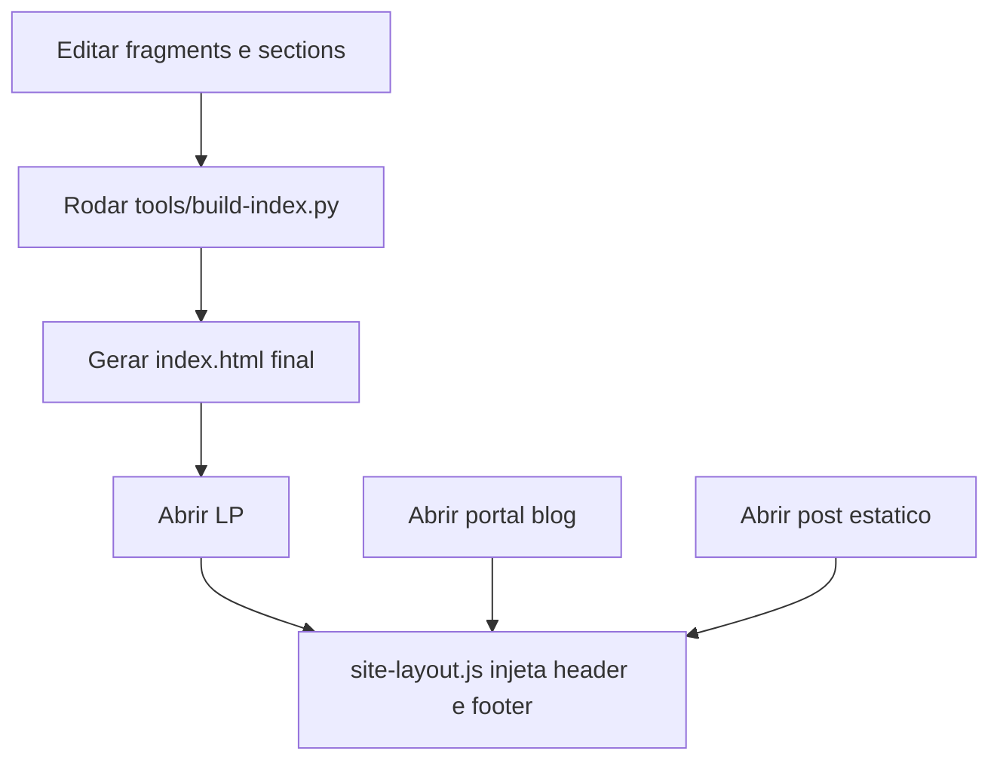

# FluxoInteligente IA

Projeto frontend estático da marca FluxoInteligente IA, composto por:
- Landing page principal na raiz (`index.html`)
- Portal de notícias (`blog/index.html`)
- Posts publicados como páginas estáticas datadas em `blog/<ano>/<mes>/<dia>/<slug>/index.html`

O projeto usa HTML/CSS/JS vanilla, um script Python para gerar a LP final a partir de fragments e um pipeline Node (Tailwind) para os cards/posts gerados pelo blog-bot.

## Visão Geral

- A LP é mantida de forma modular em `pages/componentes/` e `pages/lp/sections/`.
- O arquivo final `index.html` é gerado por `tools/build-index.py`.
- O portal do blog vive em `blog/index.html`. Posts são páginas estáticas geradas pelo `automation/blog-bot/` (na raiz do repositório) — não há renderização por slug via query-string.
- Header e footer globais são injetados por `assets/js/site-layout.js` via slots.

## Stack e Tecnologias

- HTML5
- CSS3 (custom + Tailwind compilado em `css/site-tailwind.css`, usado nos cards/posts do blog-bot)
- JavaScript (vanilla)
- Python 3 (para build local da LP)
- Google Fonts (Sora e JetBrains Mono)

O `package.json` que controla o pipeline Tailwind fica na **raiz do monorepo** (`/data/coderush-sites/package.json`), não dentro deste subprojeto. Rebuild do CSS: `npm run build:css` na raiz.

## Arquitetura e Fluxo



## Estrutura de Pastas

```text
fluxointeligenteia/
├─ index.html                         # Landing principal (gerada)
├─ blog/
│  ├─ index.html                      # Portal de noticias (ativo)
│  └─ 2026/<mes>/<dia>/<slug>/        # Posts estaticos (gerados pelo blog-bot)
├─ assets/
│  ├─ css/
│  │  ├─ index.css
│  │  ├─ blog.css
│  │  └─ site-shell.css
│  ├─ js/
│  │  ├─ index.js
│  │  ├─ site-layout.js
│  │  ├─ site-shell.js
│  │  └─ lp-bootstrap.mjs            # carregamento dinamico opcional (requer HTTP server)
│  └─ img/
├─ css/                               # CSS compilado/auxiliar
│  ├─ site-tailwind.css               # Tailwind compilado (gerado por npm run build:css na raiz)
│  ├─ hub-parity.css
│  └─ styles.css
├─ pages/
│  ├─ blog/
│  │  └─ blog.html                    # Template legado de QA — NAO e o blog em producao
│  ├─ componentes/
│  │  ├─ cursor/fragment.html
│  │  ├─ scroll-progress/fragment.html
│  │  ├─ slot-header/fragment.html
│  │  ├─ sticky-cta/fragment.html
│  │  ├─ slot-footer/fragment.html
│  │  ├─ whatsapp/fragment.html
│  │  ├─ flux-guide/fragment.html
│  │  └─ mobile-drawer/fragment.html
│  └─ lp/
│     └─ sections/
│        ├─ hero/section.html
│        ├─ success-modal/section.html
│        ├─ trust/section.html
│        ├─ value/section.html
│        ├─ how/section.html
│        ├─ features/section.html
│        ├─ interactive/section.html
│        ├─ testimonials/section.html
│        ├─ blog/section.html
│        ├─ faq/section.html
│        ├─ form-section/section.html
│        ├─ cta/section.html
│        └─ newsletter/section.html
├─ site-tailwind.input.cjs            # entrada do Tailwind
├─ tools/
│  └─ build-index.py
└─ sitemap.xml
```

## Pré-requisitos

- Python 3.x (para gerar `index.html`)
- Node + npm (apenas se for rebuildar o Tailwind dos cards do blog — opcional para edição da LP)
- Navegador moderno

## Como Rodar Localmente

### Modo recomendado (funciona com `file://`)

1. Na raiz deste subprojeto, gere a LP:
   ```bash
   python tools/build-index.py
   ```
2. Abra `index.html` no navegador.

Este modo não depende de servidor HTTP para renderizar a LP.

### Modo opcional com servidor HTTP

Use apenas para testar o carregamento dinâmico via `assets/js/lp-bootstrap.mjs`:
```bash
python -m http.server 8000
```
Acesse `http://localhost:8000/`.

### Rebuild do Tailwind (somente se alterar classes nos cards do blog)

A partir da raiz do monorepo (`/data/coderush-sites`):
```bash
npm run build:css
```
Isso regenera `fluxointeligenteia/css/site-tailwind.css`.

## Fluxo Correto de Edição da LP

Sempre edite as fontes modulares, **não o `index.html` final** — ele é regenerado e qualquer edição direta é sobrescrita.

1. Edite componentes em `pages/componentes/<nome>/fragment.html`
2. Edite seções em `pages/lp/sections/<nome>/section.html`
3. Regenere a LP:
   ```bash
   python tools/build-index.py
   ```
4. Valide no navegador.

Ordem de montagem está hardcoded em `tools/build-index.py` (constantes `COMPONENTS_TOP`, `SECTIONS`, `COMPONENTS_BOTTOM`).

## Páginas e Roteamento

- Landing principal: `index.html`
- Portal de notícias: `blog/index.html`
- Posts publicados: `blog/<ano>/<mes>/<dia>/<slug>/index.html`

### Posts atuais

Os posts são gerados pelo `automation/blog-bot/` (cron a cada 3 dias). Exemplos publicados em maio/2026:
- `blog/2026/05/09/implementar-agentes-corporativos-ia-governanca/`
- `blog/2026/05/06/canais-integrados-base-operacional-agentes-corporativos/`
- `blog/2026/05/03/canais-integrados-auditoria-agentes-corporativos-ia/`

> **Importante**: não existe `blog-post.html?post=<slug>`. O fluxo legado por query-string foi descontinuado. Posts são páginas estáticas independentes.

## Convenções Importantes

### `data-site` no `<body>`

Usado por `assets/js/site-layout.js` para calcular links e paths relativos do header/footer:
- `data-site="home"` — LP na raiz
- `data-site="blog"` — páginas do blog
- `data-site="internal"` — demais páginas internas

### Header/Footer por slots

As páginas devem conter:
- `#flux-slot-header`
- `#flux-slot-footer`

O `site-layout.js` injeta o HTML final nesses pontos com base em `data-site`.

### Posicionamento da marca

FluxoInteligente IA é posicionada como **empresa de agentes corporativos integrados ao negócio** — com automação, RAG, tools, canais, permissões, auditoria, observabilidade e governança. Evitar copy que reduza o produto a "chatbot" ou "automação genérica". Ver `/data/coderush-sites/CLAUDE.md` para guidelines de tom.

## Troubleshooting

### LP abre vazia ou incompleta

Causa comum: dependência de `fetch()` em `file://`.

Solução:
```bash
python tools/build-index.py
```
e abra o `index.html` gerado.

### Alterei section/fragment e nada mudou

Regenerar:
```bash
python tools/build-index.py
```

### Header/footer não aparecem

Verificar:
- existência de `#flux-slot-header` e `#flux-slot-footer` na página
- carregamento de `assets/js/site-layout.js`
- valor correto de `data-site` no `<body>`

### Cards do blog na home estão sem cor/estilo

Os cards usam classes Tailwind. Se adicionou uma classe nova com cor ou opacidade arbitrária, é preciso liberar no safelist (`tailwind.fluxointeligenteia.cjs` na raiz) e rodar `npm run build:css`.

### Links/estilos quebrados no portal do blog ou em posts

Verificar prefixos relativos. Posts em `blog/<ano>/<mes>/<dia>/<slug>/` precisam subir 4 níveis até a raiz do site (`../../../../assets/...`).

## Deploy

Push em `main` dispara webhook que faz `git fetch + reset` no servidor. Não há build remoto — apenas sync direto. Antes de comitar, garantir que o `index.html` foi regenerado se houve mudança em fragments/sections.

## Referências Internas

- `/data/coderush-sites/CLAUDE.md` — guidelines do monorepo (tom editorial, blog-bot, deploy)
- `tools/build-index.py`
- `assets/js/site-layout.js`
- `automation/blog-bot/` (na raiz do repo) — pipeline que gera os posts
